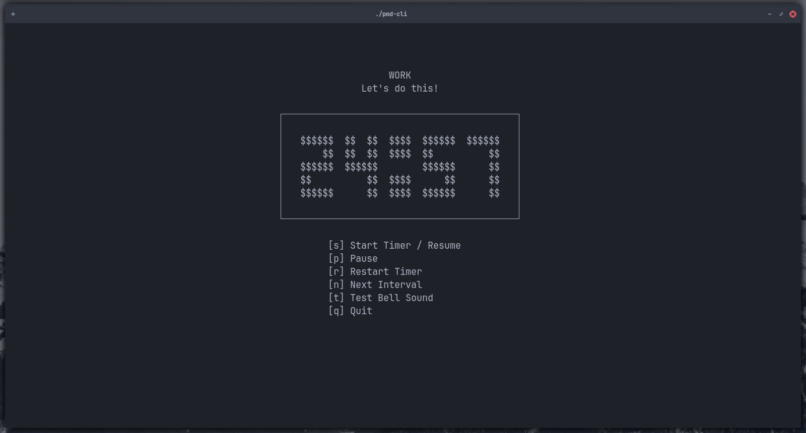

# pmd-cli - Terminal Pomodoro Timer

A minimalist Pomodoro timer built with C and ncurses, featuring audio notifications and intuitive keybindings for the terminal.



## Features

- 🍅 **Classic Pomodoro intervals**: 25 min work, 5 min break, 15 min long break
- 🔁 **Full cycle**: 4 work sessions with short breaks and a long break
- 🔊 **Audio notifications** when timer completes (using `aplay`)
- ⌨️ **Intuitive keybindings** for complete control
- 📦 **Lightweight**: runs entirely in your terminal

## Installation

### Prerequisites

- Linux/Unix environment
- `ncurses` library
- `aplay` (usually part of alsa-utils)
- `gcc` or any C compiler
- `make` (optional)

### Building from Source

1. Clone the repository:
```bash
git clone https://github.com/andrexm/pmd-cli.git
cd pmd-cli
```

2. Compile:
```bash
gcc -o pmd-cli pmd-cli.c -lncurses
```
Or using `make`:
```bash
make
```

3. (Optional) Install system-wide:
```bash
sudo cp pmd-cli /usr/local/bin/
```

### Sound Setup

For audio notifications to work:

1. Create the configuration directory:
```bash
mkdir -p ~/.config/pmd-cli/sounds
```

2. Copy the sound file:
```bash
cp sounds/magiaz-campainha-331260.wav ~/.config/pmd-cli/sounds/
```

## Usage

Simply run from your terminal:
```bash
./pmd-cli
```
Or if installed system-wide:
```bash
pmd-cli
```

The timer will start paused, waiting for your command.

### Keybindings

| Key | Action |
|-----|--------|
| `q` | Quit the application |
| `s` | Start the timer / Resume from pause |
| `p` | Pause the current timer |
| `n` | Skip to next interval |
| `r` | Restart current interval |
| `t` | Test bell sound |

After starting the timer, you need to pause it first to do another action (including quit).

### Timer Sequence

The app follows the standard Pomodoro Technique:

1. **Work** - 25 minutes
2. **Short Break** - 5 minutes
3. **Work** - 25 minutes
4. **Short Break** - 5 minutes
5. **Work** - 25 minutes
6. **Short Break** - 5 minutes
7. **Work** - 25 minutes
8. **Long Break** - 15 minutes

After the long break, the cycle repeats from the beginning.

## How It Works

- The display shows current interval type (WORK/BREAK/LONG BREAK) and remaining time
- When a timer reaches zero, it automatically:
  1. Plays the bell sound (if sound file exists)
  2. Advances to the next interval
  3. Pauses until you press `s` to start

## Troubleshooting

**No sound when timer ends:**
- Ensure `aplay` is installed: `which aplay`
- Check if sound file exists: `ls ~/.config/pmd-cli/sounds/`
- Test sound manually: `aplay ~/.config/pmd-cli/sounds/magiaz-campainha-331260.wav`
- Try the test key `t` while the app is running

**Timer not displaying correctly:**
- Make sure your terminal supports ncurses
- Try resizing your terminal window (resize it and reopen the app)

## Dependencies

- **ncurses**: Terminal handling library
- **aplay**: ALSA sound player (usually pre-installed on most Linux distributions)

On Debian/Ubuntu, install missing dependencies with:
```bash
sudo apt install libncurses5-dev alsa-utils
```

On Arch Linux:
```bash
sudo pacman -S ncurses alsa-utils
```

## Contributing

Contributions are welcome! Feel free to:
- Report bugs
- Suggest features
- Submit pull requests

## License

The MIT License (MIT). Please see [License File](LICENSE) for more information.

## Author

Created by [andrexm](https://github.com/andrexm)

